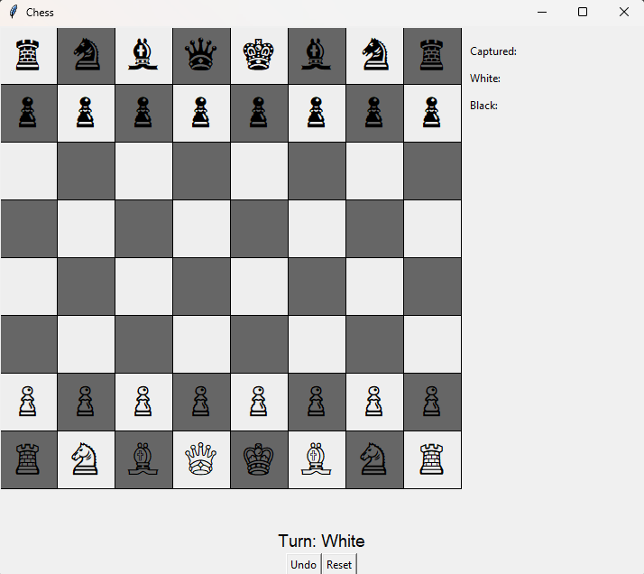
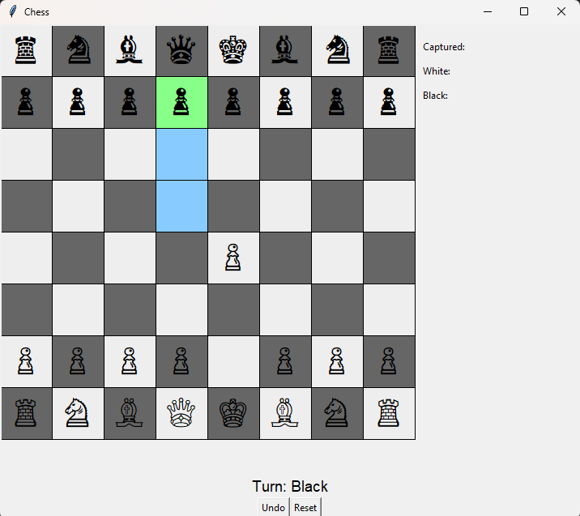
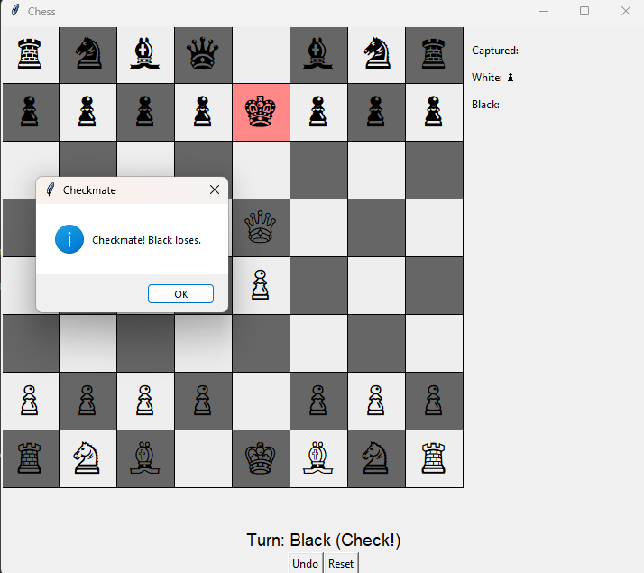

<h1 align="center">♟️Chess_Game</h1>

<p align="center">
  <b>A complete chess game with rules, move validation, and GUI built using Python & Tkinter.</b><br>
  <sub>Supports castling, promotion, en passant, undo, and more.</sub>
</p>

<p align="center">
  
</p>

---

## 🎯 Overview

This project is a full-featured chess engine and GUI built with **Python** and **Tkinter**. It is built entirely from scratch without external libraries for logic or rendering. It is ideal for learning GUI design, game logic, and chess rules implementation

---

## 🎮 Features

✅ Classic 8×8 chessboard with Unicode pieces  
✅ All standard rules of chess enforced:
- Legal move validation
- Castling (both sides)
- En passant
- Promotion (default to queen)
- Check & checkmate detection

✅ Interactive GUI with:
- Highlighted selected pieces and possible moves
- Undo last move
- Turn indicators
- Error prevention (can’t move enemy pieces or make illegal moves)

---

## 🚀 Installation

### Prerequisites
- Python 3.6+
- No external libraries needed (uses only built-in `tkinter`)

### Run the Game
```bash
git clone https://github.com/your-username/tkinter-chess.git
cd Chess_Game
python chess_game.py
````

---

## 🧩 How It Works

The project consists of:

* `chess_game.py`: Main script containing all classes for board logic and Tkinter rendering.
* `Board` class handles:

  * Piece setup
  * Movement rules
  * Special chess rules
* `GUI` layer handles:

  * Drawing the board and pieces
  * Event bindings
  * Updating board state after moves

Architecture is modular and easily extensible for future enhancements.

---

## 🖼 Screenshots

<p float="left">
  
  
</p>

---

## 🤝 Contributing

Feel free to contribute to this project! Fork the repository and submit a pull request. If you find any issues or have suggestions, please open an issue.


